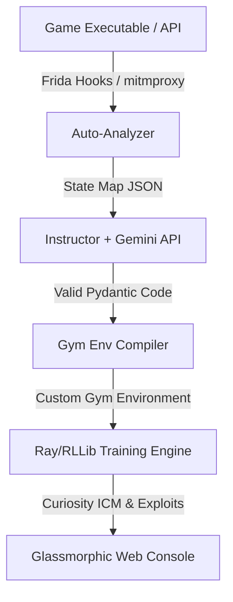
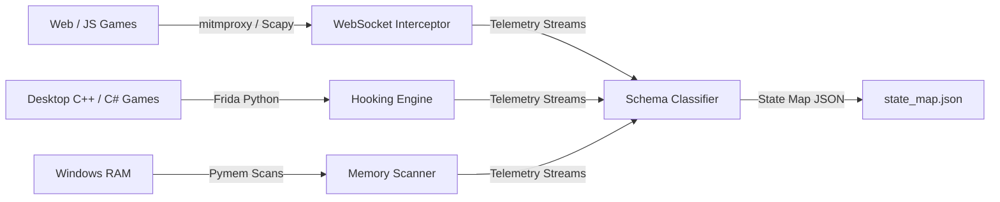
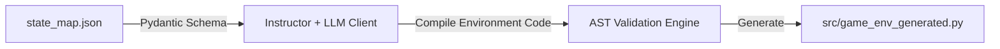
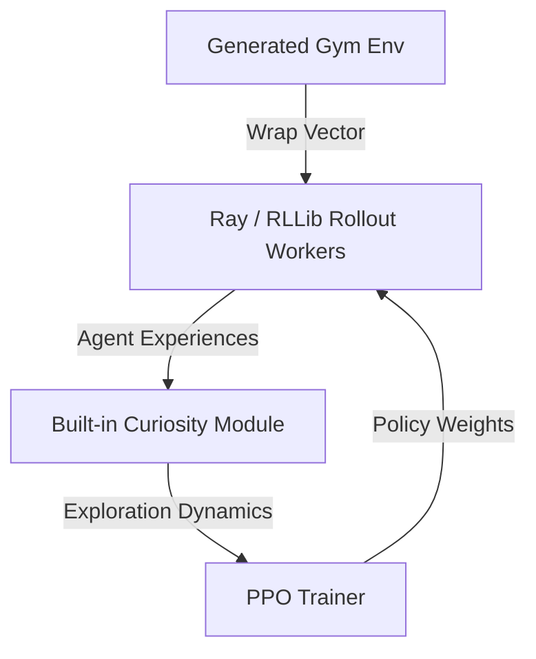
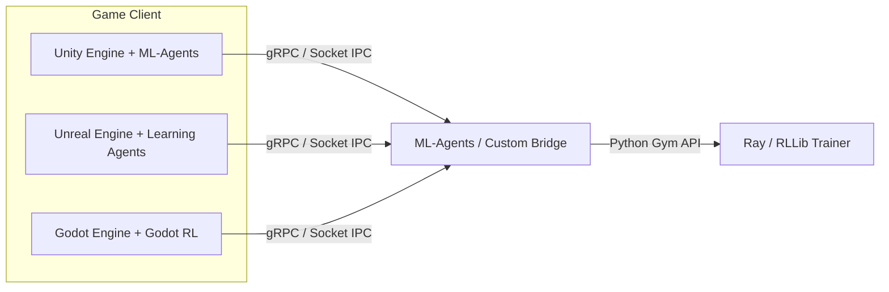

# The Bridge-Maker: B2B RL-Driven Game Testing & Behavior Platform
## Long-Term Master Implementation Plan & Architecture Blueprint (Updated)

This roadmap outlines the design for "The Bridge-Maker," incorporating industry-standard tools (Frida, Pymem, mitmproxy, Ray/RLLib, Instructor) to build a scalable B2B platform.

---

## 🛠 Architectural Overview: "The Orchestrator"

Our value proposition is **Orchestration & Verification**. Rather than building low-level memory monitors or C++ network sockets from scratch, we build the "glue" layer that automates the integration pipeline:

---

## Phase 1: Dynamic Discovery & Interception (Auto-Pilot)

### 1. Objective
Extract active game telemetry (coordinates, metrics, variables) dynamically from running processes or WebSocket networks without manual source-code instrumentation.

### 2. Architectural Design

### 3. Step-by-Step Engineering Tasks
* **Task 1.1: Web & WebSocket Proxy Interceptor**
  * Integrate `mitmproxy` to intercept local TCP loopback traffic or game client API queries.
  * Write packet sniffing handlers using `Scapy` to detect WS frames and decode game state objects on the fly.
* **Task 1.2: Frida Hook Injector**
  * Implement JavaScript hooks in `src/auto_analyzer.py` using `frida-python` to inject hooks into compiled executables.
  * In Unity IL2CPP games, hook `UnityEngine.Transform::get_position` to capture coordinate values.
  * In Unreal Engine, hook native `AActor::GetActorLocation` to log actor movements.
* **Task 1.3: Windows memory scanner fallback**
  * Write a Windows memory scanning module using `pymem` to scan process memory segments for coordinate addresses and health values based on change frequencies.
* **Task 1.4: Discovered state mapping**
  * Output discovered telemetry parameters to `state_map.json`, detailing memory offsets, JSON paths, and normalization limits.

### 4. Verification & Testing Criteria
* Verify Frida hooks successfully hook into a test IL2CPP binary and print location variables.
* Confirm `mitmproxy` captures local WebSocket payloads and flattens nested state maps.
* Assert that the generated `state_map.json` contains valid ranges and data types.

### 5. Pitfalls & Mitigations
* **Anti-cheat measures (Denuvo, Easy Anti-Cheat)**: Frida/Pymem memory injection is blocked by anti-cheat engines.
  * *Mitigation*: Enable developer/debug builds for internal QA teams, or use network proxy wrappers (mitmproxy) which operate out-of-process and are not flagged.

---

## Phase 2: Schema-Guided Gym Environment Compiler (Generator)

### 2.1 Objective
Compile `state_map.json` specs into Gymnasium environments. We use **Instructor** to enforce strict output schemas, ensuring syntax stability.

### 2.2 Architectural Design

### 2.3 Step-by-Step Engineering Tasks
* **Task 2.1: Define Pydantic Code Specs**
  * Define structured Pydantic models (using the `Instructor` library) to model Gym environment structures.
  * Require the model to return code segments (observation space setups, normalizations, action steps).
* **Task 2.2: Structured LLM Code Generation**
  * Setup `instructor.patch()` with the Gemini/OpenAI API.
  * Provide the LLM with the custom Pydantic wrapper schema and `state_map.json`, forcing it to output validated environment code.
* **Task 2.3: Syntactic Verification**
  * Validate output code blocks using Python's `ast` module to confirm syntax correctness before writing to disk.

### 2.4 Verification & Testing Criteria
* Verify the LLM generates wrapper environments matching our Pydantic schema.
* Confirm the generated wrapper file is imported and executes without syntax errors.

---

## Phase 3: Ray/RLLib Curiosity Engine (Brain)

### 3.1 Objective
Transition our training loop from Stable-Baselines3 to **Ray/RLLib** to leverage native Curiosity implementations (ICM), distributed scaling, and multi-agent training.

### 3.2 Architectural Design

### 3.3 Step-by-Step Engineering Tasks
* **Task 3.1: RLLib environment registration**
  * Update `src/train.py` to register our Gym environment inside Ray.
* **Task 3.2: Configure built-in curiosity models**
  * Configure RLLib's built-in `Curiosity` exploration settings in the trainer config (e.g. settings for intrinsic curiosity models, scaling factors, feature network layouts).
* **Task 3.3: Distributed training infrastructure**
  * Setup Ray cluster scaling options to run training rollouts across multiple local cores or headnodes.

### 3.4 Verification & Testing Criteria
* Verify that RLLib initializes and executes training across multiple worker processes.
* Confirm that the RLLib built-in ICM model generates exploration rewards.

---

## Phase 4: Unified Web Console & Telemetry Dashboard

### 4.1 Objective
Provide developers with a live web interface to monitor exploration progress, telemetry metrics, and anomaly logs.

### 4.2 Architectural Design
* Telemetry variables are logged via Ray callbacks and pushed to the HTTP Dashboard server.
* The frontend reads telemetry data to render line charts and spatial coordinates.

### 4.3 Step-by-Step Engineering Tasks
* **Task 4.1: Ray Callback Integrations**
  * Write a custom Ray/RLLib `DefaultCallbacks` handler to extract step rewards and curiosity levels.
  * Push metric updates to the dashboard server.
* **Task 4.2: Web Dashboard UI**
  * Update `src/dashboard.py` to render real-time reward charts and spatial exploration maps.

### 4.4 Verification & Testing Criteria
* Verify the dashboard updates live during training runs.
* Confirm the coordinate map renders exploration density correctly.

---

## Phase 5: High-Performance Engine Bridges

### 5.1 Objective
Integrate the Python training system with game engines by leveraging existing wrappers (Unity ML-Agents, Godot RL, Unreal Engine Learning Agents).

### 5.2 Architectural Design

### 5.3 Step-by-Step Engineering Tasks
* **Task 5.1: ML-Agents / Godot RL Adaptor**
  * Build adaptor layers in Python to map Unity ML-Agents and Godot RL wrapper outputs to standard Gymnasium formats.
* **Task 5.2: Unreal Engine Learning Agents Adaptor**
  * Implement gRPC bindings to exchange observations and actions with Unreal Engine 5.4's Learning Agents plugin.
* **Task 5.3: Unified configuration mappings**
  * Map YAML reward configs directly to the client scripts of ML-Agents, UE, and Godot RL, allowing designers to configure rewards on the engine side.

### 5.4 Verification & Testing Criteria
* Verify gRPC latency remains under 3 milliseconds between the engines and the Python training system.
* Confirm game physics tick smoothly without stuttering during active training sessions.
