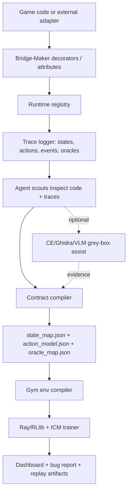

# The Bridge-Maker: Master Implementation Plan v3
## Annotation/Adapter-First Game QA & RL Framework

**Status:** Active current direction; SDK MVP proof implemented  
**Date:** 2026-06-16  
**Supersedes:** archived CE/Ghidra-first and CoQ/socket experiments  
**Product thesis:** Indie developers should not learn PDDL, reverse engineering, RLlib, or memory scanning. They should expose a small semantic contract, run the SDK overnight, and receive a trainer, RL agent, and bug report.

---

## 1. Why We Are Pivoting

The previous black-box/grey-box plan proved useful as infrastructure research, but it is not a credible default product path for indie developers. Cheat Engine, Ghidra, pointer stability, GUI setup, ASLR, stale addresses, and action discovery are too fragile to make "one click for any exe" the main promise.

The working core is everything after a semantic game contract exists:

- `state_map.json` can drive environment generation.
- `live_env_generated.py` can expose a Gymnasium interface.
- `swarm_trainer.py` can run Ray/RLlib + Curiosity.
- Dashboard and Oracle layers can report training and stuck states.

The failing assumption was that the system can reliably infer the semantic contract from arbitrary binaries without developer help. The new plan makes that contract explicit, tiny, and assisted by agents.

The paper `2402.12393v2.pdf` ("On Automating Video Game Regression Testing by Planning and Learning") supports this direction. Their workflow also depends on developer-provided logs/state predicates, then learns an action model. Their PDDL path is too heavy for ordinary indie teams. Bridge-Maker keeps the useful part, semantic traces from gameplay, and removes the PDDL authoring burden.

---

## 2. Product Definition

Bridge-Maker becomes a **contract-first QA/RL framework** with three input modes:

1. **SDK Mode (primary):** The developer annotates existing game state/action/event functions with decorators or engine-native attributes.
2. **Adapter Mode (primary for reverse projects):** A modder/researcher writes a thin external adapter, for example around an existing NoitaRL reverse-engineered project. The adapter exposes the same contract without modifying the target game core.
3. **Grey-Box Assist Mode (advanced):** CE MCP, Ghidra MCP, and VLM agents help discover or verify fields/actions when annotations are missing. This is a power tool, not the default onboarding path.

The platform no longer claims "zero game-specific code" as the main path. The new constraint is better:

> Game-specific semantics live only in annotations, adapters, or generated maps. The training/orchestration core remains game-agnostic.

---

## 3. The Developer UX We Are Designing For

The ideal indie flow:

```python
from bridge_maker import bm

@bm.hp(bounds=(0, 100))
def player_hp():
    return player.health

@bm.position(x="x", y="y", bounds=(-5000, 5000))
def player_pos():
    return player.x, player.y

@bm.item("gold")
def gold_count():
    return inventory.count("gold")

@bm.action("move_left", key="a")
def move_left():
    input.press("a")

@bm.oracle("invalid_health")
def invalid_health(s):
    return s.hp < 0 or s.hp > s.hp_max
```

Then:

```powershell
bridge-maker discover
bridge-maker train --overnight
bridge-maker report
```

The developer should not write new gameplay functions just for Bridge-Maker. They decorate existing getters, command handlers, events, or adapter functions. The SDK can also generate a suggestion report:

```text
Suggested annotations:
  Player.TakeDamage -> @bm.event("damage")
  Inventory.AddItem -> @bm.event("item_added")
  Player.health     -> @bm.hp(bounds=(0, player.max_health))
```

---

## 4. Core Contract

All syntax sugar compiles to a small internal schema.

### State Decorators

- `@bm.state(name, role, bounds=None, dtype="float")`
- `@bm.hp(bounds=None, max_ref=None)`
- `@bm.position(x="x", y="y", z=None, bounds=None)`
- `@bm.item(name=None, collection=None)`
- `@bm.flag(name)`
- `@bm.scalar(name, bounds=None)`

State annotations are read-only. They define observation variables and normalization bounds for Gym generation.

### Action Decorators

- `@bm.action(name, key=None, cooldown=None)`
- `@bm.move(direction, key=None)`
- `@bm.interact(name="interact", key=None)`
- `@bm.use_item(name=None, key=None)`
- `@bm.attack(name="attack", key=None)`

Action annotations expose legal controls. They may wrap direct engine methods, keypresses, controller commands, or adapter calls.

### Event and Oracle Decorators

- `@bm.event(name)` captures state transitions for action model learning.
- `@bm.oracle(name, severity="bug")` defines invalid states or suspected bugs.
- `@bm.reset` defines a clean episode reset if the game supports one.
- `@bm.snapshot` returns a compact world snapshot for reports and replay.

This is deliberately not PDDL. Bridge-Maker can learn a lightweight action model from traces, but the user-facing contract remains Pythonic and engine-friendly.

---

## 5. Agent Roles in the New Architecture

The agents still matter, but their job changes from "magically reverse a binary" to "amplify a minimal developer contract."

| Agent | New responsibility |
|---|---|
| `CodeScout` | Scans repo/adapters for decorated functions and likely missing candidates. |
| `TraceScout` | Runs instrumented sessions and validates that annotations produce changing, useful traces. |
| `SchemaScout` | Converts registry + traces into `state_map.json`, action maps, and oracle specs. |
| `ActionModelScout` | Learns rough preconditions/effects from traces for test generation and stuck-state diagnosis. |
| `GreyBoxScout` | Optional CE/Ghidra/VLM helper when a value/action is missing or needs verification. |
| `General` | Synthesizes final map, test goals, reward shaping, and report narrative. |

The General may recommend annotations, but it should not silently invent game semantics. Every game-specific field must be trace-backed, adapter-backed, or explicitly accepted by the developer.

---

## 6. System Flow



---

## 7. Implementation Roadmap

### Phase 0 - Documentation Reset

Status: complete.

Goal: stop future context from pulling the project back into the failed "universal binary magic" promise.

- Remove stale active roadmap files that point back to the CE/Ghidra-first or CoQ/socket approach.
- Treat this file as the current plan.
- Keep `AGENTS.md` and `PRD.md` aligned with SDK/Adapter-first architecture and grey-box optional tooling.
- Mark CoQ/Harmony/socket work as historical experiment notes only.

Done when: a new session can read the docs and understand that decorators/adapters are the primary path.

### Phase 1 - Annotation SDK Core

Status: complete for the Python SDK MVP.

Goal: create the minimal Python SDK that collects semantic annotations without coupling to a specific game.

- Add `src/sdk/annotations.py` with the public `bm` decorator namespace.
- Add a registry that records `StateSpec`, `ActionSpec`, `EventSpec`, `OracleSpec`, and optional reset/snapshot hooks.
- Add `src/sdk/runtime.py` to sample registered state, invoke actions, evaluate oracles, and emit trace frames.
- Add `src/sdk/export.py` to write:
  - `state_map.json`
  - `action_map.json`
  - `oracle_map.json`
  - `trace.jsonl`
- Keep decorators thin. They should not require the developer to learn RL, Gym, PDDL, or MCP.

Done when: a dummy annotated Python target exports a valid `state_map.json` and `trace.jsonl` without CE/Ghidra.

### Phase 2 - Adapter-First Validation with NoitaRL

Status: in progress. `probable-basilisk/noita-ws-api` was inspected at commit `47054b0`; live Noita execution is pending game/mod setup.

Goal: prove that the framework works on a real reverse-engineered game project without pretending to rediscover everything.

- Add an external adapter pattern: `adapters/<game>/bridge.py` imports `bm` and maps existing reverse-engineered accessors/actions.
- Use the existing NoitaRL work as the first serious adapter target.
- Keep all Noita-specific details out of the core SDK.
- Export traces from scripted/manual play sessions.
- Compare SDK-derived `state_map.json` against NoitaRL's known state/action surface.

Done when: NoitaRL adapter can produce a state/action/oracle contract and run at least a smoke-test env loop.

### Phase 3 - Agent-Assisted Annotation Mining

Goal: make "decorate a hundred functions" unnecessary.

- Add `CodeScout` to scan Python/C#/Lua source or adapter files for likely state/action/event functions.
- Generate an annotation suggestion report instead of editing code silently.
- Add confidence levels and evidence snippets:
  - function name
  - return type / field access
  - call sites
  - trace correlation if available
- Add a CLI command:
  - `bridge-maker suggest --repo <path>`
  - `bridge-maker validate --trace trace.jsonl`

Done when: agents can propose useful annotations for a small project and validate which annotated fields actually change during play.

### Phase 4 - Contract Compiler and Gym Generation

Goal: connect the new SDK contract to the working Phase 3/4 infrastructure.

- Extend `state_map_schema.py` to support SDK source metadata without breaking existing maps.
- Teach `env_compiler.py` to generate two runtime modes:
  - `sdk_env_generated.py`: calls SDK/adapter functions directly.
  - `live_env_generated.py`: keeps the existing pymem path for grey-box mode.
- Use the same Gymnasium contract for both modes.
- Preserve existing Ray trainer compatibility.

Done when: annotated dummy target and NoitaRL adapter both compile into Gymnasium envs and run through `swarm_trainer.py`.

### Phase 5 - Bug Reports, Not Just Trainers

Status: MVP complete for static JSON/HTML reports from SDK traces.

Goal: ship the output an indie developer actually wants in the morning.

- Add `report.json` and `report.html` generation.
- Include:
  - discovered state/action contract
  - training summary
  - oracle hits
  - freeze/softlock suspicions
  - replayable action traces
  - screenshots when available
- Dashboard remains useful for live runs, but the overnight artifact is the report.

Done when: `bridge-maker train --overnight` produces a human-readable bug report without requiring the user to inspect Ray logs.

### Phase 6 - Grey-Box Assist as Power Tool

Goal: preserve the CE/Ghidra work where it is valuable, without making it the normal path.

- CE MCP can help locate state variables for adapter authors.
- Ghidra MCP can explain unknown functions and suggest annotations.
- VLM can label HUD values and correlate them with traces.
- Grey-box discoveries must flow into the same contract compiler.

Done when: missing annotations can be assisted by CE/Ghidra evidence, but the SDK path still works without either server running.

---

## 8. Design Decisions

### Decision 1 - Decorators over PDDL

PDDL is powerful but bad indie UX. Decorators are familiar, local, reviewable, and code-adjacent. We can still learn action models internally, but we should not ask users to model planning domains.

### Decision 2 - Minimal Required Annotations

Asking a developer to annotate 100 functions is better than asking for PDDL, but still too much. The MVP should work with roughly:

- 3-8 state fields
- 4-12 actions
- 2-5 oracles
- optional reset/snapshot hooks

The swarm can discover coverage gaps and suggest more annotations over time.

### Decision 3 - Adapter Mode Is First-Class

Many useful targets will not be the developer's own game. NoitaRL-style reverse projects should be treated as legitimate adapters, not hacks. This keeps the core product honest: Bridge-Maker consumes semantic contracts, regardless of who authored them.

### Decision 4 - Grey-Box Becomes Assistive

CE/Ghidra/VLM remain valuable, but as "help me fill or verify the contract" tools. They are not the main success path because their setup and runtime fragility are too high for indie onboarding.

---

## 9. Suggested Public CLI

```powershell
bridge-maker init
bridge-maker suggest --repo .
bridge-maker validate --adapter adapters/noita/bridge.py
bridge-maker export --adapter adapters/noita/bridge.py --out state_map_noita.json
bridge-maker generate --map state_map_noita.json --runtime sdk
bridge-maker train --map state_map_noita.json --overnight --dashboard
bridge-maker report --run runs/latest
```

Existing `python -m src.run_session` can remain for developer use, but the product CLI should be simpler.

---

## 10. Success Criteria

The new MVP is successful when:

1. A developer can annotate an existing toy game in under 15 minutes.
2. The SDK exports a valid state/action/oracle contract without MCP servers.
3. The generated Gym env trains under the existing Ray/RLlib pipeline.
4. The dashboard shows live state, curiosity, oracle hits, and action traces.
5. The overnight run produces a bug report that is useful without reading logs.
6. A NoitaRL adapter proves the adapter path on a real reverse-engineered project.

---

## 11. What We Should Stop Doing

- Stop promising universal one-click binary understanding as the core product.
- Stop treating CE/Ghidra setup as acceptable onboarding for indie developers.
- Stop adding game-specific bridges into the main core.
- Stop optimizing for "agent can theoretically infer everything" before we have a crisp user-authored contract.

---

## 12. Immediate Next Steps

1. Keep `AGENTS.md`, `PRD.md`, and this roadmap aligned around SDK/Adapter-first architecture.
2. Keep `tests/test_contract_sdk.py` green.
3. Use `examples/buggy_roguelike.py` as the canonical bug-finding demo.
4. Use `adapters/noita_ws/README.md` as the next real external adapter target record.
5. Wire a live Noita/NoitaRL adapter once the game/mod runtime is available.
6. Connect SDK contracts to the existing trainer/dashboard stack after the report path is stable.

This keeps the strongest parts of the current repo and cuts away the part that kept biting us: pretending reverse engineering can be made invisible for every user.
